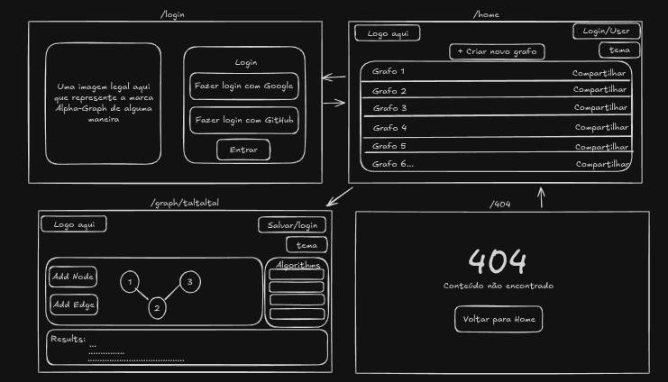

# 🔺 Alpha-Graph


O **Alpha-Graph** é uma aplicação web interativa para **visualizar e estudar algoritmos em grafos**, como BFS, DFS, Dijkstra, Prim, Kruskal e outros.  
Permite criar grafos manualmente, executar algoritmos passo a passo com animação, além de salvar e compartilhar grafos.

---

## 📸 Preview (Protótipo)

> Protótipo inicial criado no Excalidraw / Wireframe

     
📌 [Wireframe Inicial](https://excalidraw.com/#json=RYSTbwH_KI0lT_wQixDsY,E9Aj_8E8ZWcVeAsqkO79VA)

---

## 🚀 Tecnologias Utilizadas

| Camada       | Tecnologias                                                     |
|--------------|-----------------------------------------------------------------|
| **Frontend** | Next.js 14, React Flow, TailwindCSS, Zustand, TypeScript       |
| **Backend**  | Node.js 18, Express, Zod, Prisma ORM                           |
| **Banco**    | PostgreSQL (Supabase)                                          |
| **Autenticação** | NextAuth.js (Login via Google/GitHub)                     |
| **Deploy**   | Vercel (Frontend), Render/Railway (Backend), Supabase (DB)     |

---

## 📂 Estrutura do Projeto

```yml
Alpha-Graph/
├── frontend/   # Next.js + Tailwind + React Flow
├── backend/    # Node.js + Express + Prisma
├── graph-core/ # Algoritmos de grafos em TypeScript
└── README.md   # Documentação do projeto
```

---

## 🛠 Funcionalidades

✅ Criar e editar grafos interativamente  
✅ Executar algoritmos passo a passo com animação  
✅ Mostrar lista e matriz de adjacência  
✅ Salvar e carregar grafos do usuário  
✅ Compartilhar grafos via link único  
✅ Histórico de execuções para comparar algoritmos  

---

## 📅 Roadmap

### 🚩 **MVP (Produto Mínimo Viável)**
- [ ] Setup inicial (frontend, backend, banco, graph-core)
- [ ] Implementar BFS, DFS, Dijkstra no `graph-core`
- [ ] Criar UI com React Flow para desenhar grafos
- [ ] Mostrar representações (lista/matriz)
- [ ] Login + salvamento de grafos
- [ ] Deploy no Vercel (frontend) + Render/Railway (backend) + Supabase (DB)

### 🔜 **Funcionalidades Futuras**
- [ ] Algoritmos avançados: Prim, Kruskal, Bellman-Ford, Floyd-Warshall
- [ ] Dark/Light Mode
- [ ] Exportar/importar grafo em JSON

---

## 📦 Como Rodar Localmente

### 🔹 1. Clonar o repositório
```bash
git clone https://github.com/SEU-USUARIO/alpha-graph.git
cd alpha-graph
```
### 🔹 2. Configurar o Backend
```bash
cd backend
npm install
npx prisma init
```
- Criar arquivo .env com:
```ini
DATABASE_URL="sua-string-do-supabase"
```
- Rodar migração:
```bash
npx prisma migrate dev --name init
```
- Iniciar API:
```bash
npm run dev
```
### 🔹 3. Configurar o Frontend
```bash
cd ../frontend
npm install
npm run dev
```

## 🤝 Contribuindo
1. Faça um fork do projeto
2. Crie uma branch: git checkout -b minha-feature
3. Faça commit das mudanças: git commit -m 'Adicionei minha feature'
4. Faça push: git push origin minha-feature
5. Abra um Pull Request 🎉

## 📜 Licença
Este projeto está sob a licença MIT.
Sinta-se livre para usar e modificar!

## 📌 Contato
💼 Autor: [Arthur Vinicius Carneiro Nunes](https://github.com/ApenasUmSonhador)    
📧 Email: [arthurvininunes@gmail.com](mailto:arthurvininunes@gmail.com)

